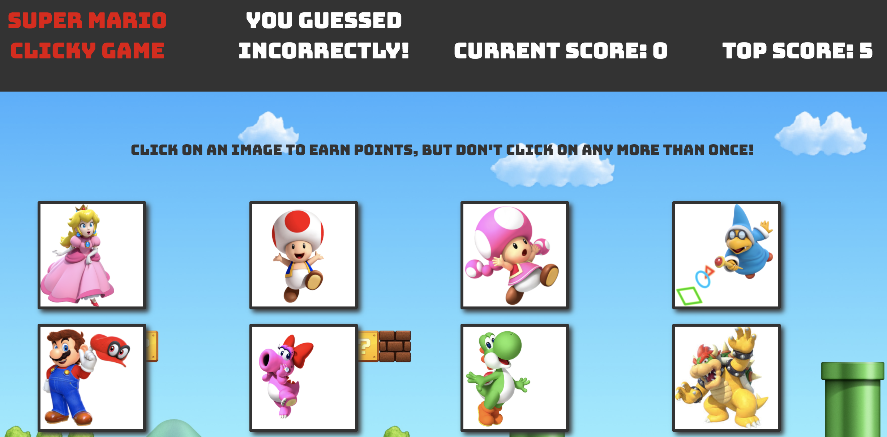

# Clicky-Game

## Overview 

This app is a memory game with React. The idea of the game is to click on the cards without clicking on the same one twice until you click all 12 characters.

## Technologies used
- React
- Bootstrap
- CSS
- ES6

## App Link
https://julienguyen86.github.io/Clicky-Game/

## Author
**Julie Nguyen**
